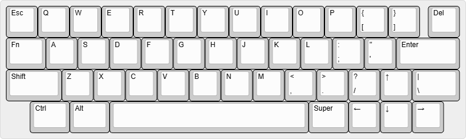
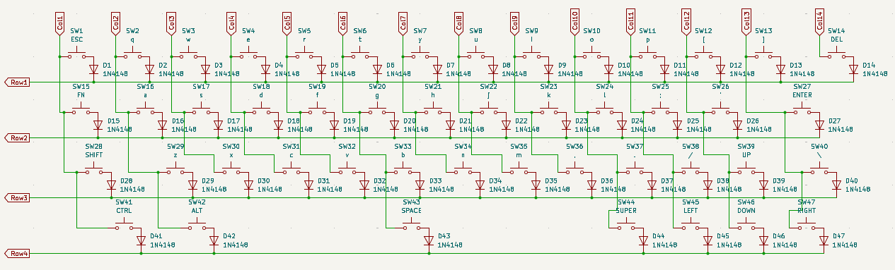

# snaKEY

### todo list:

- pcb borders
- lcd/oled display
- plate/case (3d print or order cnc)

### 50%, staggered, wired only

- **1** raspberry pi pico / pico2
- **47** diodes *(1N4148)*
- **47** switches
- **1** 2u plate mount stab (enter)
- **1** 6.25u plate mount stab
- keycaps

### LAYOUT:
[permalink to layout editor](https://www.keyboard-layout-editor.com/##@@=Esc&=Q&=W&=E&=R&=T&=Y&=U&=I&=O&=P&=%7B%0A%5B&=%7D%0A%5D&_x:0.25%3B&=Del%3B&@_w:1.25%3B&=Fn&=A&=S&=D&=F&=G&=H&=J&=K&=L&=%2F:%0A%2F%3B&=%22%0A'&_w:2%3B&=Enter%3B&@_w:1.75%3B&=Shift&=Z&=X&=C&=V&=B&=N&=M&=%3C%0A,&=%3E%0A.&=%3F%0A%2F%2F&=%E2%86%91&_w:1.5%3B&=%7C%0A%5C%3B&@_x:0.75&w:1.25%3B&=Ctrl&_w:1.25%3B&=Alt&_a:7&w:6.25%3B&=&_a:4&w:1.25%3B&=Super&=%E2%86%90&=%E2%86%93&=%E2%86%92)

 

note:**enter key has to be the 2u numberpad one**

### PROTOTYPE PICTURES:

